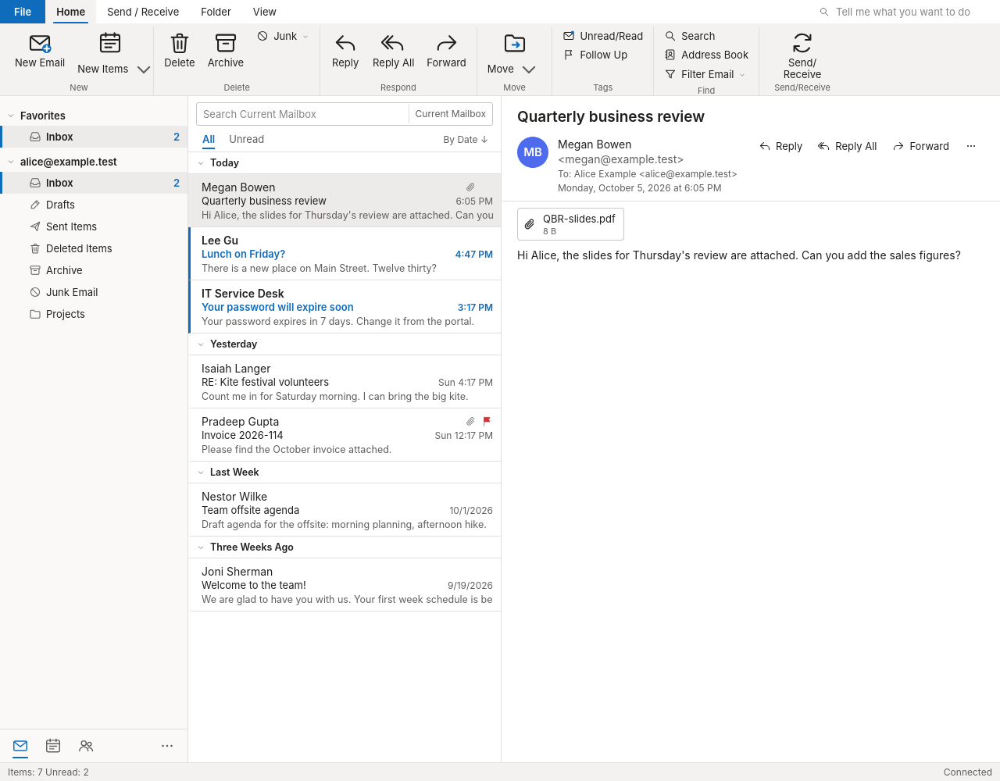
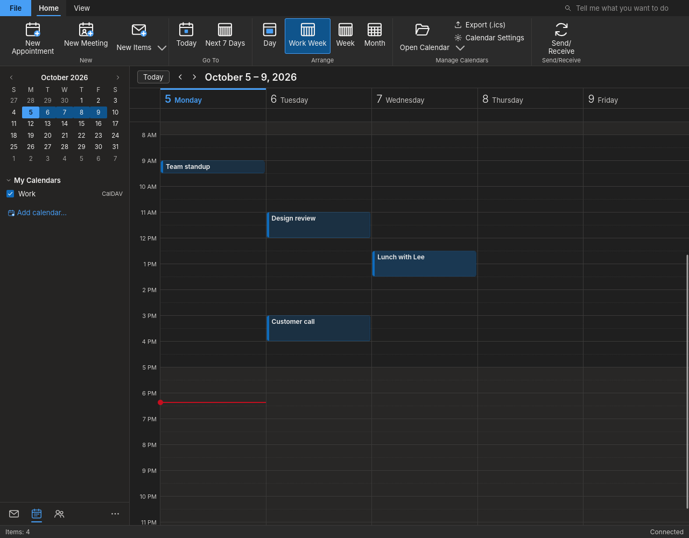

# SG Mail

Stained Glass OS's mail and calendar program. Its window is arranged the way
many office workers know from classic desktop mail clients: a ribbon (Home,
Send / Receive, Folder, View), the folder pane with Favorites and unread
counts, the message list grouped by date (Today, Yesterday, Last Week, ...),
the reading pane, a message window, and a Calendar with Day, Work Week, Week
and Month views. The keys are the familiar ones (Ctrl+N, Ctrl+R,
Ctrl+Shift+R, Ctrl+F forward, Ctrl+E search, Ctrl+Q / Ctrl+U read/unread,
Insert flag, Delete, Backspace archive, Ctrl+Shift+V move, F9 Send/Receive,
Ctrl+1 / Ctrl+2 Mail / Calendar, Ctrl+Alt+1..4 calendar views).

(More in docs/screenshots: the message window, light and dark. The look
gate takes them against the test servers.)

## Thunderbird underneath

SG Mail is built on **Mozilla Thunderbird** (Debian's `thunderbird` package,
not modified). Thunderbird does the mail and calendar work: IMAP, POP and
SMTP accounts, the provider's own sign-in page for Microsoft (Outlook.com,
Microsoft 365) and Google accounts (OAuth2 with Thunderbird's registration:
nothing to register for SG Mail), setup from the e-mail address (ISPDB /
autoconfig), the calendar (local, CalDAV, Internet calendars; meeting
invitations), the address book, filters and the offline store. Security
updates come with Debian's Thunderbird.

What SG Mail adds is its window: an extension (`extension/`, id
`sg-mail@stained-glass-os.org`) that makes Thunderbird's main window SG
Mail's when Thunderbird runs with SG Mail's profile:

- `ui/` -- the main window (ribbon, folder pane, message list, reading pane,
  calendar, navigation bar, status bar), the message window and the
  appointment window, written against Thunderbird's WebExtension APIs
  (accounts, folders, messages, address books);
- `experiments/` -- a privileged experiment API (`sgmail`) for what those
  APIs do not reach: taking over the main window, Send/Receive, sending a
  message written in our window (Thunderbird's own sending: SMTP, Sent copy,
  drafts, Outbox), the calendar manager (calendars, events, recurrence,
  meetings, iTIP accept/decline), and opening Thunderbird's own account setup,
  account settings and options;
- `background.js` -- claims each main window, and turns Thunderbird's own
  message windows (mailto: links, "send to") into ours.

The reading pane shows HTML mail made safe: no scripts, frames, forms or
event handlers; a sandboxed frame without script; pictures from the network
only when the reader clicks "Download pictures" (or allows the sender).

`/usr/bin/sg-mail` (`launcher/sg-mail`) runs Thunderbird with SG Mail's own
profile (`~/.local/share/sg-mail/profile`; a person's own Thunderbird
profile is not touched), laying the extension and SG Mail's settings
(`launcher/user.js`, then an administrator's `/etc/sg-mail/user.js`) into it
on each start.

Account setup is Thunderbird's own (File > Add Account). Microsoft
accounts: Thunderbird signs in to Outlook.com and Microsoft 365 mail with
OAuth2 on Microsoft's own login page; some work or school tenants require
their administrator to approve Thunderbird once (Microsoft's "admin
consent"), as for any Thunderbird user. Calendars of Microsoft accounts are
not reachable by Thunderbird 140 (no Exchange calendar in it): subscribe to
the calendar's published .ics link, or use CalDAV providers.

## Building and testing

    make lint            # syntax, manifests, desktop entry, AppStream, trademarks
    make xpi             # build/out/sg-mail@stained-glass-os.org.xpi
    make deb             # ../sg-mail_*_all.deb
    make root            # the test root (once): Debian trixie with Thunderbird,
                         # Xvfb, Dovecot, Radicale, aiosmtpd (rootless mmdebstrap)
    make test            # every gate
    make test-mutation   # every gate against its mutants (test/mutants.json)

The gates (`test/gate/*-gate.py`) run Thunderbird headless (Xvfb) in the test
root with no network but its own loopback: Dovecot (IMAP), an aiosmtpd SMTP
server that delivers locally, Radicale (CalDAV) and a small web server (the
account-setup lookup, and pictures whose fetches are counted). Nothing ever
reaches a real mail provider. They drive SG Mail's windows through a test
channel that exists only under a gate (`SG_MAIL_TEST_OUT`).

## License

AGPL-3.0-or-later (see LICENSE). Thunderbird is Mozilla's, MPL-2.0, and is
used as Debian ships it.
