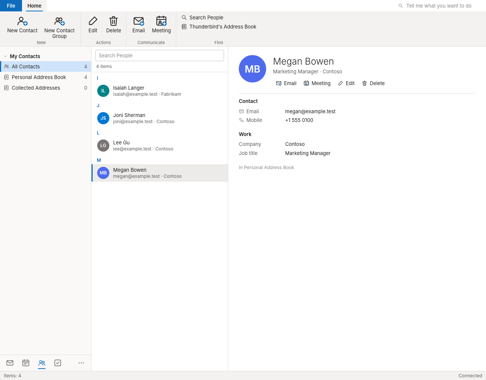
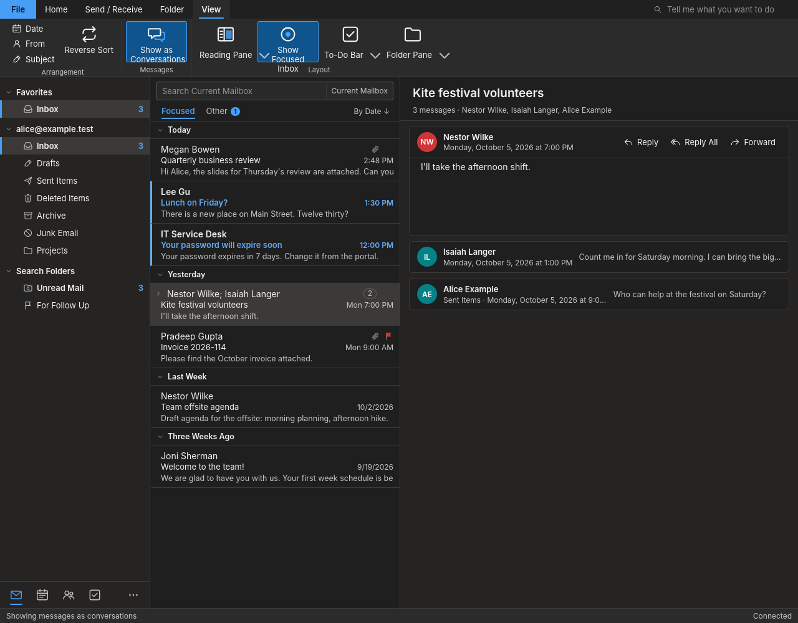
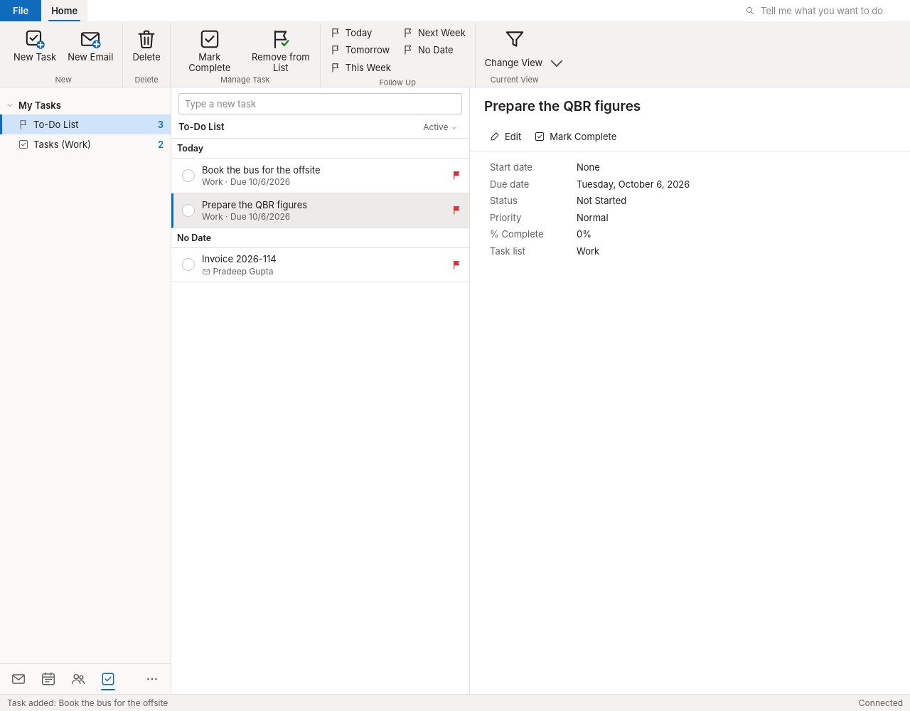
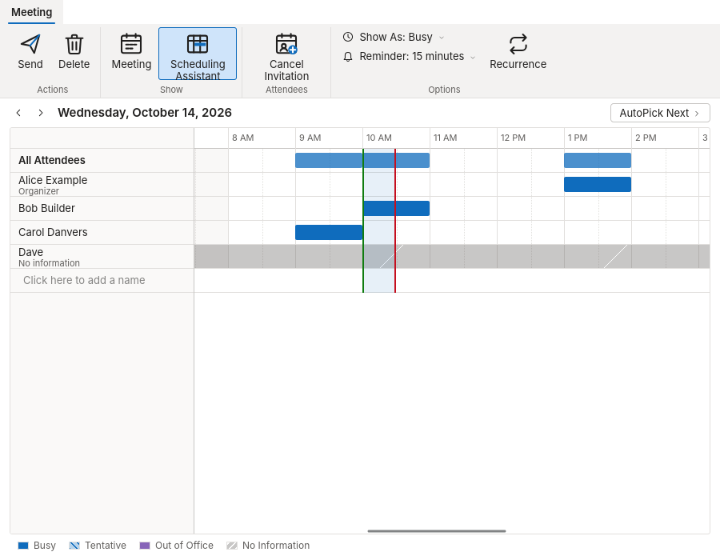

# SG Mail

Stained Glass OS's mail and calendar program. Its window is arranged the way
many office workers know from classic desktop mail clients: a ribbon (Home,
Send / Receive, Folder, View), the folder pane with Favorites, unread counts
and Search Folders, the message list grouped by date (Today, Yesterday, Last
Week, ...), the reading pane (right, bottom or off), a message window, a
Calendar with Day, Work Week, Week and Month views, and People. The keys are
the familiar ones (Ctrl+N, Ctrl+R, Ctrl+Shift+R, Ctrl+F forward, Ctrl+E
search, Ctrl+Q / Ctrl+U read/unread, Insert flag, Delete, Backspace archive,
Ctrl+Shift+V move, F9 Send/Receive, Ctrl+1 / Ctrl+2 / Ctrl+3 / Ctrl+4 Mail
/ Calendar / People / Tasks, Ctrl+Alt+1..4 calendar views, Ctrl+Shift+1..9
Quick Steps).

- **Focused Inbox**: the Inbox in two tabs, Focused and Other. Bulk mail
  (mailing lists, newsletters, no-reply senders: their List-Unsubscribe,
  List-Id, Precedence and Auto-Submitted headers) goes to Other; people you
  know stay Focused (your contacts, people you have written or replied to).
  Decided on this computer from what Thunderbird keeps; nothing is sent
  anywhere. Right-click: Move to Focused / Other, or Always Move (the
  sender's mail from now on). View > Show Focused Inbox turns it off.
- **Calendar by the mouse**: drag an appointment to another time or day
  (Day, Work Week, Week, Month), drag its top or bottom edge (or the right
  end of an all-day or Month item) to change its length; for an occurrence of
  a series SG Mail asks "Just this one" or "The entire series", for your own
  meetings whether to send the attendees an update. Drag over free time (or
  days in Month) and type: a new appointment in place (Enter saves, Escape
  drops it; Enter without typing opens the appointment window).
- **People** in SG Mail's own window: the address books and their contact
  groups, the contact list with search, the contact card (Email, Meeting,
  Edit, Delete), new and edited contacts and groups. They are Thunderbird's
  address books (vCards, mailing lists): its own address book shows the same
  (More > Thunderbird's Address Book).
- **Reading pane** right, at the bottom (the list one line a message) or
  off, from View > Reading Pane; remembered, as the splitters are.
- **Search Folders** (Unread Mail, For Follow Up), **Categorize**
  (Thunderbird's tags, kept on the server as IMAP keywords), **Rules >
  Always Move Messages From** (a Thunderbird filter, run on new mail; Manage
  Rules & Alerts opens Thunderbird's filters).

- **Conversations** (View > Show as Conversations, remembered): the
  messages of a conversation (the Message-IDs they answer: References and
  In-Reply-To) are one row with its count, opened by its arrow or the Right
  key; the reading pane shows the whole conversation newest first, one's
  own replies from Sent Items too, each message a card that opens.
- **Clean Up** (Home > Delete > Clean Up: Conversation or Folder): a
  message goes to Deleted Items when a later reply in its conversation
  quotes all of it; unread, flagged and categorized messages stay.
  **Ignore** (Conversation): the conversation goes to Deleted Items, and so
  does every later message in it (also those that came while SG Mail was
  closed, when their folder is opened); Stop Ignoring Conversation in
  Deleted Items brings it back. Ignored conversations are kept by SG Mail on
  this computer.
- **Quick Steps** (Home > Quick Steps, the message's menu, Ctrl+Shift+1..9):
  Move to: ?, To Manager, Team Email, Done, Reply & Delete and Create New,
  as the classic client has them; a step asks for its folder or address the
  first time (First Time Setup); Manage Quick Steps edits, copies, reorders,
  deletes and resets them. Actions: move, copy, delete, archive, read,
  unread, flag, mark complete, categorize, reply, reply all, forward to,
  new message to.
- **Tasks** (Ctrl+4): the To-Do List (tasks and flagged mail by when they
  are due: Overdue, Today, Tomorrow, This Week, Next Week, Later, No Date)
  and each calendar's task list; "Type a new task", the task window (start
  and due day, status, priority, % complete, reminder, notes), Mark
  Complete, Follow Up (Today ... No Date, also on mail from Home > Follow
  Up), views Active / Today / Overdue / Completed / All. Tasks are
  Thunderbird's calendar tasks (VTODO, on a CalDAV server or this
  computer); flagged mail is the IMAP flag (its due day kept on this
  computer; Mark Complete clears the flag). **To-Do Bar** (View > To-Do Bar)
  beside the mail, remembered.
- **Scheduling Assistant** (a meeting's window): every attendee's busy time
  for the day in a grid -- one's own calendars, the calendars of theirs one
  has opened (shared calendars), and the free/busy their calendar server
  gives (CalDAV scheduling: Thunderbird asks the server of a CalDAV calendar
  that offers it); "No information" otherwise. AutoPick Next finds the next
  half hour in the working day when all are free; a click in the grid moves
  the meeting.
- **Shared calendars** (Calendar > Open Calendar > Open Shared Calendar):
  a colleague's calendar, by name or address, on the CalDAV server one's
  own calendar is on, as far as they share it (read, or edit as a
  delegate); listed under Shared Calendars, removed from its menu.
- **Automatic Replies** (File > Automatic Replies): where the account's
  server keeps mail rules (ManageSieve with Sieve vacation: Dovecot, Cyrus,
  Stalwart and many hosts), the reply is set there, in the active Sieve
  script beside the person's own rules, and goes out while this computer is
  off (once to each sender, not to mailing lists, within the time range).
  Where it does not (Exchange and Microsoft 365, OAuth-only accounts,
  servers without ManageSieve), SG Mail answers from this computer instead,
  only while it runs -- the dialog and the bar under the ribbon say so.

Not there yet, against the classic desktop client in daily use: Room
Finder; automatic replies set on Exchange or Microsoft 365 servers
themselves (SG Mail's own answer from this computer stands in);
conversations across folders in the message list (the reading pane has
them); Clean Up of folders and subfolders.

(More in docs/screenshots: each light and dark, and the message window. The
look gate takes them against the test servers; the Scheduling Assistant's
comes from the scheduling gate.)

## Thunderbird underneath

SG Mail is built on **Mozilla Thunderbird**, not modified. On Stained Glass
OS that is the `thunderbird` package of its own apt repository: Mozilla's
official Linux build of the current Release (sg-image's `thunderbird/`,
verified against Mozilla's signed checksums, rebuilt when Mozilla releases;
it replaces Debian's ESR package in place). SG Mail also runs on Debian's
Thunderbird 140. Thunderbird does the mail and calendar work: IMAP, POP and
SMTP accounts, Exchange (EWS) and Microsoft 365 (Microsoft Graph) mail
accounts, the provider's own sign-in page for Microsoft (Outlook.com,
Microsoft 365) and Google accounts (OAuth2 with Thunderbird's registration:
nothing to register for SG Mail), setup from the e-mail address (ISPDB /
autoconfig, Exchange Autodiscover), the calendar (local, CalDAV, Internet
calendars; meeting invitations), the address book, filters and the offline
store. Security updates come with the thunderbird package.

What SG Mail adds is its window: an extension (`extension/`, id
`sg-mail@stained-glass-os.org`) that makes Thunderbird's main window SG
Mail's when Thunderbird runs with SG Mail's profile:

- `ui/` -- the main window (ribbon, folder pane, message list, reading pane,
  calendar, navigation bar, status bar), the message window and the
  appointment window, written against Thunderbird's WebExtension APIs
  (accounts, folders, messages, address books);
- `experiments/` -- a privileged experiment API (`sgmail`) for what those
  APIs do not reach: taking over the main window, Send/Receive, sending a
  message written in our window (Thunderbird's own sending: SMTP, Sent copy,
  drafts, Outbox), the calendar manager (calendars, events, tasks,
  recurrence, meetings, iTIP accept/decline, events moved by the mouse,
  free/busy, shared calendars found over WebDAV), what the Focused Inbox
  and conversations decide by, rules (Thunderbird's filters), automatic
  replies on the server (a ManageSieve client, STARTTLS, the password
  Thunderbird keeps for the account), and opening Thunderbird's own account
  setup, account settings and options;
- `background.js` -- claims each main window, and turns Thunderbird's own
  message windows (mailto: links, "send to") into ours.

The reading pane shows HTML mail made safe: no scripts, frames, forms or
event handlers; a sandboxed frame without script; pictures from the network
only when the reader clicks "Download pictures" (or allows the sender).

`/usr/bin/sg-mail` (`launcher/sg-mail`) runs Thunderbird with SG Mail's own
profile (`~/.local/share/sg-mail/profile`; a person's own Thunderbird
profile is not touched), laying the extension and SG Mail's settings
(`launcher/user.js`, then an administrator's `/etc/sg-mail/user.js`) into it
on each start.

Account setup is Thunderbird's own (File > Add Account): on Thunderbird 145
and later its Account Hub, a dialog over SG Mail's window; on 140 its setup
tab. Microsoft accounts: type the address; the Account Hub finds Microsoft
365 and Exchange servers (Autodiscover) and offers Microsoft Graph (Microsoft
365) or Exchange Web Services (Exchange servers) besides IMAP, and signs in
with OAuth2 on Microsoft's own login page. Some work or school tenants
require their administrator to approve Thunderbird once (Microsoft's "admin
consent"), as for any Thunderbird user.

## Microsoft accounts: mail, calendar and contacts through DavMail

No Thunderbird release reads or writes Microsoft 365 / Outlook.com /
Exchange calendars and contacts yet (Mozilla is writing Microsoft Graph
calendar support; Thunderbird 157 has an early, read-only version behind
`calendar.graph.enabled`, which SG Mail does not offer: it takes every time
as UTC, bug 2058697). SG Mail therefore uses **DavMail**
(davmail.sourceforge.net, GPL-2.0-or-later; the `sg-davmail` package, built
by sg-image's `davmail/` from upstream's release), a gateway that talks
Microsoft Graph (or an Exchange server's EWS) and offers IMAP, SMTP, CalDAV
and CardDAV on this computer. Thunderbird's own IMAP, SMTP, CalDAV and
CardDAV clients use it, so everything SG Mail does with mail, calendars
(drag and resize, invitations, reminders) and People works on Microsoft
accounts, on Debian's Thunderbird 140 as on 157.

- **Adding an account** (File > Add Account, and the first start): SG Mail
  asks the address first. A Microsoft address (Outlook.com, Hotmail, Live,
  MSN, or a domain whose mail Microsoft 365 receives: its MX at
  `*.mail.protection.outlook.com`) is offered **Connect**: DavMail's own
  sign-in window opens (Microsoft's login page, multi-factor and all), and
  once signed in SG Mail makes Thunderbird's mail account (IMAP and SMTP on
  the gateway), the calendar `Calendar (address)` and the address book
  `Contacts (address)` -- one sign-in for all three. "Use Thunderbird's
  account setup" (and any other address) goes to Thunderbird's own setup,
  with the address already typed in: Thunderbird's Exchange (EWS) and
  Microsoft 365 (Graph) mail stays available that way.
- **An account added by Thunderbird's own setup** (EWS, Graph or IMAP at
  Microsoft): SG Mail offers "Calendar and contacts (Microsoft)": the same
  gateway, for the calendar and contacts only (also Calendar > Add calendar
  > Microsoft 365, Outlook.com or Exchange). An Exchange server of one's own
  (EWS at another address) signs in with its password, which Thunderbird
  asks for once.
- **The gateway**: one per account, the systemd user service
  `sg-mail-davmail@NAME` (`/usr/lib/sg-mail/sg-mail-davmail`, which writes
  DavMail's settings in `~/.config/sg-mail/davmail/NAME/`: directory 0700,
  files 0600). It listens on 127.0.0.1 only (`davmail.allowRemote=false`,
  `davmail.bindAddress`), serves only that address
  (`davmail.userWhiteList`), and never opens a sign-in window itself: it
  only uses the token DavMail stored (`O365StoredTokenAuthenticator`). The
  sign-in is a short-lived second DavMail on a port of its own, whose first
  request opens DavMail's window; SG Mail ends it when the sign-in is done
  or cancelled. DavMail keeps the refresh token in its token file,
  encrypted with a password SG Mail makes up for the account and keeps in
  Thunderbird's password manager (the password Thunderbird gives the
  gateway). SG Mail never sees a Microsoft password or token, and has no
  sign-in code of its own. `/usr/bin/sg-mail` starts the gateways; they
  stop with the session.
- **When something is wrong** the Calendar's side pane says so, per
  account: the gateway is not running (Start), DavMail has no valid sign-in
  ("Sign in again": DavMail's window again), Microsoft cannot be reached.
- **Removing the account** (Account Settings) removes its gateway, DavMail's
  settings and token, the calendar, the address book and the passwords.

DavMail's mail path, against Thunderbird's own EWS/Graph mail: folders,
search (translated to Exchange queries), attachments and flags work as IMAP;
new mail is polled (IMAP IDLE answered by DavMail checking the folder every
minute: `davmail.imapIdleDelay=1`) rather than pushed; Graph delta sync
(DavMail 7) keeps large folders quick; Sent Items is Exchange's own copy
(`davmail.smtpSaveInSent`; Thunderbird keeps none, so there is no second
copy). The first sync of a big mailbox goes through the gateway on this
computer.

## Building and testing

    make lint            # syntax, manifests, desktop entry, AppStream, trademarks
    make xpi             # build/out/sg-mail@stained-glass-os.org.xpi
    make deb             # ../sg-mail_*_all.deb
    make root            # the test root (once): Debian trixie with Thunderbird,
                         # Xvfb, Dovecot (with Sieve and ManageSieve), Radicale,
                         # aiosmtpd (rootless mmdebstrap)
    make test            # every gate
    make test TB_DEB=../thunderbird_157.0.1-sg1_amd64.deb
                         # every gate on that thunderbird package, over
                         # Debian's, in a root of its own
    make test-mutation   # every gate against its mutants (test/mutants.json)

The gates (`test/gate/*-gate.py`) run Thunderbird headless (Xvfb) in the test
root with no network but its own loopback (the davmail gates: also a network
card that leads nowhere, and a systemd user manager of their own; they need
the `sg-davmail` package, `SG_DAVMAIL_DEB=`, default sg-image's
`build/davmail-deb/`, laid over the root with SG Mail's package by `make
stage`): Dovecot (IMAP; ManageSieve, and
its delivery agent running Sieve), an aiosmtpd SMTP server that delivers
locally, Radicale (CalDAV, with sharing rights) and a small web server (the
account-setup lookup, and pictures whose fetches are counted). Nothing ever
reaches a real mail provider. They drive SG Mail's windows through a test
channel that exists only under a gate (`SG_MAIL_TEST_OUT`).

## License

AGPL-3.0-or-later (see LICENSE). Thunderbird is Mozilla's, MPL-2.0, and is
used as Mozilla builds it.
